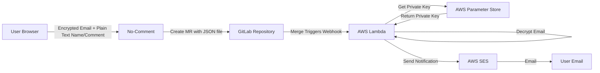

## Protecting User Privacy in Comment Systems

After implementing the [No-Comment system](/2025/03/07/no-comment-commenting/) for my blog, I identified a privacy concern: when users submit comments, their email addresses were visible in plain text in the GitLab merge requests. This meant that anyone with access to the repository could potentially see these email addresses.

No-Comment works similarly to Staticman - when a user submits a comment, it creates a merge request on GitLab with a JSON file containing the comment data. When I approve and merge the request, the comment appears on my blog. The problem was that the email field in this JSON was in clear text.

To solve this issue, I wanted to add an extra layer of security by encrypting email addresses before they even leave the user's browser, ensuring they remain protected throughout the entire workflow.

## The Hybrid Encryption Approach

I decided to implement a hybrid approach that combines client-side encryption with server-side decryption only when necessary. This approach offers several advantages:

1. **Only email addresses** are encrypted in the browser before submission, keeping names and comments in plain text for display
2. The encrypted email data is stored in GitLab, so even if someone gains access to the repository, they can't read the emails
3. Only I can decrypt the emails using a private key that's securely stored in AWS Parameter Store
4. No changes to the No-Comment server-side code were needed for the basic comment submission process

## Why Only Encrypt Email Addresses?

I made a deliberate choice to encrypt only the email field while leaving the commenter's name and message in plain text. This decision was based on several factors:

1. **Privacy Balance**: Email addresses are personally identifiable information that should be protected, while names (which could be pseudonyms) and comments are intended for public display
2. **Functionality**: Comments need to be readable in the GitLab repository for moderation and display on the blog
3. **Implementation Simplicity**: Focusing only on email encryption simplified the implementation
4. **Performance**: Encrypting only what's necessary keeps the system efficient

## How No-Comment Works with GitLab

To understand the encryption solution, it helps to understand the full workflow:

1. A user fills out the comment form on my blog with their name, email, and message
2. Before submission, the email is encrypted in their browser using my public RSA key
3. No-Comment receives the form data and creates a merge request on GitLab with a JSON file containing the comment data (with encrypted email)
4. I review the merge request and approve it if the comment is appropriate
5. When the merge request is merged, a GitLab webhook triggers my AWS Lambda function
6. The Lambda function decrypts the email using my private key and sends a notification to the commenter

This way, the email is never stored in plain text in the GitLab repository, protecting user privacy while still allowing for notifications.

## Architecture Overview

Here's a diagram of how the entire system works:



## Client-Side Implementation

For the client-side encryption, I chose to use the node-forge library, which is actively maintained and provides robust cryptographic functions. Here's how I implemented it:

```javascript
// Load forge from CDN
document.addEventListener('DOMContentLoaded', function() {
  const script = document.createElement('script');
  script.src = 'https://cdn.jsdelivr.net/npm/node-forge@1.3.1/dist/forge.min.js';
  script.integrity = 'sha256-MZBH/+oaYu4R0Ib7qmQZtCZ8wr/OjXZldKyBvFNq/Uo=';
  script.crossOrigin = 'anonymous';
  script.onload = setupEncryption;
  document.head.appendChild(script);
});

function setupEncryption() {
  const form = document.getElementById('comment-form');
  if (!form) return;

  // RSA public key - only public key is exposed
  const publicKeyPem = `-----BEGIN PUBLIC KEY-----
  MIICIjANBgkqhkiG9w0BAQEFAAOCAg8AMIICCgKCAgEA1HkoughjOBPXuA7k5F8V
  [... key content abbreviated for security ...]  
  -----END PUBLIC KEY-----`;

  form.addEventListener('submit', function(e) {
    e.preventDefault();
    
    // Get ONLY the email field - name and message remain unencrypted
    const emailField = form.querySelector('input[name="fields[email]"]');
    if (!emailField || !emailField.value) {
      form.submit();
      return;
    }

    try {
      // Parse the public key
      const publicKey = forge.pki.publicKeyFromPem(publicKeyPem);
      
      // Encrypt using RSA-OAEP with SHA-256
      const encrypted = publicKey.encrypt(emailField.value, 'RSA-OAEP', {
        md: forge.md.sha256.create(),
        mgf1: {
          md: forge.md.sha1.create()
        }
      });
      
      // Convert to base64 for transmission
      const encryptedBase64 = forge.util.encode64(encrypted);
      emailField.value = encryptedBase64;
    } catch (error) {
      console.error('Error during encryption:', error);
    }
    
    form.submit();
  });
}
```

This script is loaded only on pages with the comment form, and it intercepts the form submission to encrypt just the email address before sending it to the server. The name and comment fields remain untouched and are submitted as plain text.

## GitLab Merge Request Format

When a user submits a comment, No-Comment creates a merge request on GitLab with a JSON file containing the comment data. With the encryption in place, the JSON looks something like this:

```json
{
  "_id": "14f77b55-a932-4be3-acf9-ddf4412046f7",
  "name": "John Doe",
  "email": "A4tB9C2dE5fG6hI7jK8lM9nO0pQ1rS2tU3vW4xY5z...",
  "message": "This is a great blog post!",
  "date": 1741359012
}
```

The email field contains the base64-encoded RSA-encrypted email address, which can only be decrypted with my private key.

## Server-Side Decryption with AWS Lambda

On the server side, I implemented an AWS Lambda function that's triggered by a GitLab webhook whenever a merge request is merged. This function decrypts the email address and sends a notification to the commenter.

Here's the core of the Lambda function:

```python
def decrypt_email(encrypted_email):
    """Decrypt the email using RSA private key"""
    try:
        # Get the RSA private key from AWS Parameter Store
        ssm = boto3.client('ssm')
        response = ssm.get_parameter(
            Name='/simbiosi.org/gitlab-webhook/rsa-private-key',
            WithDecryption=True
        )
        private_key_pem = response['Parameter']['Value']
        
        # Load the private key
        private_key = load_pem_private_key(
            private_key_pem.encode('utf-8'),
            password=None,
            backend=default_backend()
        )
        
        # Base64 decode the encrypted email
        encrypted_data = base64.b64decode(encrypted_email)
        
        # Decrypt the email using OAEP padding
        decrypted_data = private_key.decrypt(
            encrypted_data,
            padding.OAEP(
                mgf=padding.MGF1(algorithm=hashes.SHA256()),
                algorithm=hashes.SHA256(),
                label=None
            )
        )
        
        return decrypted_data.decode('utf-8')
    except Exception as e:
        print(f"Error decrypting email: {str(e)}")
        return None
```

The Lambda function is triggered by a GitLab webhook when a merge request is merged, extracts the encrypted email from the JSON payload, decrypts it, and then uses the decrypted email to send a notification to the commenter.

## Key Management

The security of this system relies on proper key management:

1. I generated a 4096-bit RSA key pair using OpenSSL
2. The public key is embedded in the client-side JavaScript
3. The private key is stored in AWS Parameter Store with encryption enabled
4. Only the Lambda function has permission to access the private key

This ensures that even if someone gains access to the GitLab repository or the Lambda function code, they can't decrypt the email addresses without the private key.

## Notification System

Once the email is decrypted, I use AWS SES to send notifications to commenters when their comments are approved and merged:

```python
def send_notification_email(email, name, message):
    """Send a notification email using Amazon SES"""
    try:
        ses = boto3.client('ses', region_name='us-east-1')
        
        subject = "Your comment has been approved and merged"
        body_text = f"""
        Hello {name},
        
        I wanted to let you know that I've reviewed and approved your comment.
        It has been successfully merged into the main branch.
        
        Your original message: "{message}"
        
        Thank you for your contribution to this project!
        
        Best regards,
        Antenore
        """
        
        response = ses.send_email(
            Source="antenore@simbiosi.org",
            Destination={
                'ToAddresses': [email]
            },
            Message={
                'Subject': {'Data': subject},
                'Body': {'Text': {'Data': body_text}}
            }
        )
        
        return True
    except Exception as e:
        print(f"Error sending email: {str(e)}")
        raise e
```

## Conclusion

By implementing client-side email encryption, I've solved the privacy issue with No-Comment where email addresses were visible in plain text in GitLab merge requests. This ensures that email addresses are never stored in plain text in the GitLab repository, while still allowing me to send notifications to commenters when their comments are approved.

The hybrid approach offers a good balance between security and functionality, and it was relatively easy to implement without changing the core No-Comment system. By encrypting only the email field and leaving the name and comment in plain text, I maintain the readability of comments while protecting the most sensitive information.

The use of asymmetric encryption with a 4096-bit RSA key provides strong security, and storing the private key in AWS Parameter Store ensures that it's properly protected.

In a future post, I'll explore how to further enhance this system with additional security features and performance optimizations.