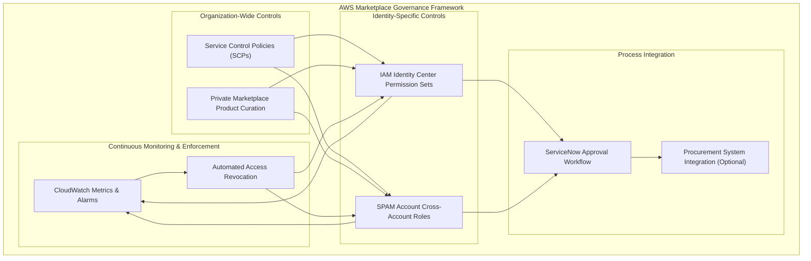

## The AWS Marketplace Governance Challenge

Cloud governance is a multifaceted challenge, but one area that often flies under the radar until it becomes problematic is AWS Marketplace governance. During my time working with large enterprise AWS environments, I've discovered that controlling Marketplace access presents unique challenges that extend beyond standard IAM and permission management.

The problem itself seems deceptively simple: *ensure that only authorized individuals can purchase software through the AWS Marketplace*. However, when you're managing dozens or hundreds of accounts across different organizational structures, with varying identity integration models, this "simple" problem quickly becomes a complex governance challenge.

## The Multi-Dimensional Problem Space

Before diving into solutions, let's understand why AWS Marketplace governance is particularly challenging in enterprise environments:

1. **Financial Controls**: Marketplace purchases directly impact AWS billing - unauthorized purchases can blow budgets and create unexpected cost spikes.

2. **Security Implications**: Not all marketplace software meets enterprise security standards - uncontrolled deployments can introduce vulnerabilities.

3. **Procurement Alignment**: Most enterprises have established procurement processes that must be integrated with cloud purchasing.

4. **Identity Complexity**: Different account types often have different identity models (federated, IAM users, SSO), requiring different control approaches.

5. **Operational Flexibility**: Legitimate needs for marketplace products must be accommodated without creating procurement bottlenecks.

I found this problem particularly challenging because some account environments had standard AWS IAM Identity Center integration, while others used a shared privileged account management (SPAM) approach with different identity patterns.

## The Complete Governance Architecture

To better understand how all these components work together, here's a visualization of the complete marketplace governance architecture:



## Solution Patterns for Marketplace Governance

Through extensive experimentation, I've found that effective Marketplace governance requires a layered approach that combines different control mechanisms. Here are the patterns that proved most effective:

### Pattern 1: Service Control Policies as the First Line of Defense

SCPs provide a strong foundation for marketplace governance. Here's a version of a policy that restricts marketplace actions:

```json
{
  "Version": "2012-10-17",
  "Statement": [
    {
      "Sid": "DenyMarketplaceAccess",
      "Effect": "Deny",
      "Action": [
        "aws-marketplace:Subscribe",
        "aws-marketplace:Unsubscribe",
        "aws-marketplace:CreateAgreementRequest",
        "aws-marketplace:AcceptAgreementRequest",
        "aws-marketplace:ViewAgreement",
        "aws-marketplace:AcceptAgreement"
      ],
      "Resource": "*",
      "Condition": {
        "StringNotLike": {
          "aws:PrincipalARN": [
            "arn:aws:iam::*:role/MarketplaceAdministrator",
            "arn:aws:iam::*:role/aws-reserved/sso.amazonaws.com/*/AWSReservedSSO_MarketplaceAdmin_*"
          ]
        }
      }
    }
  ]
}
```

This policy effectively denies all marketplace subscription actions except for identities using designated roles. I found this approach to be remarkably effective because it:

1. Works regardless of the identity model in place
2. Provides consistent controls across the organization
3. Cannot be circumvented by users with administrative access

### Pattern 2: Private Marketplace for Product Curation

Beyond controlling *who* can purchase, we also need to control *what* can be purchased. This is where Private Marketplace (PMP) becomes invaluable:

```bash
# Enable Private Marketplace in management account
aws marketplace-catalog start-change-set \
  --catalog "AWSMarketplace" \
  --change-set '[{
    "ChangeType": "CreatePrivateMarketplace",
    "Details": "{\"Name\": \"Enterprise Private Marketplace\"}"
  }]'

# Start the Private Marketplace
aws marketplace-catalog start-change-set \
  --catalog "AWSMarketplace" \
  --change-set '[{
    "ChangeType": "StartPrivateMarketplace",
    "Details": "{}"
  }]'

# Add an approved product
aws marketplace-catalog start-change-set \
  --catalog "AWSMarketplace" \
  --change-set '[{
    "ChangeType": "AssociateProductsWithPrivateMarketplace",
    "Details": "{\"ProductIds\": [\"PRODUCT-ID-1\", \"PRODUCT-ID-2\"]}"
  }]'
```

The critical realization here was that Private Marketplace must be consistently enabled across all accounts to be effective. This required:

1. Enabling PMP at the organization's management account level
2. Creating automation to verify PMP was enabled on all accounts
3. Developing processes to add approved products to the private marketplace

### Pattern 3: Role-Based Access with Time-Limited Privileges

For our implementation, we created a specialized role structure that balanced security with operational needs:

1. **MarketplaceAdministrator Role**: Created specifically for marketplace operations with the right permissions
2. **Temporary Access Model**: Access to this role only granted for 30 days
3. **Cross-Account Trust Relationships**: Implemented to maintain consistent control

For IAM Identity Center environments, we created specific permission sets:


This approach was particularly important in our shared privileged account management (SPAM) environments, where direct IAM access patterns were used instead of AWS IAM Identity Center.

### Pattern 4: Structured Approval Workflows

The final piece of the puzzle was establishing a clear process for legitimate marketplace purchases:


By implementing this structured workflow, we created a balance between security and operational efficiency, ensuring legitimate business needs could be met while maintaining proper governance.

### Pattern 5 (Optional): Procurement System Integration

For organizations with mature procurement processes, integrating AWS Marketplace with systems like SAP Ariba or Coupa can provide additional benefits:

1. **Punchout Catalogs**: Allow users to request AWS Marketplace products from within their existing procurement system
2. **Approval Workflows**: Leverage established procurement approval chains
3. **Invoice Integration**: Streamline billing and accounting processes
4. **Budget Alignment**: Connect cloud purchases to existing departmental budgets


While this integration adds complexity, it can significantly improve the user experience and procurement governance for organizations with established procurement workflows.

## The Implementation Challenge: Account Environment Diversity

The most challenging aspect of this implementation was adapting our controls to different account environments. We had several account models:

1. **Standard accounts** with AWS IAM Identity Center integration
2. **SPAM environments** for specialized administrative access
3. **Regional variations** with different compliance requirements

Each required a slightly different implementation approach while maintaining consistent security posture. The solution was to create a modular control framework:


This layered approach allowed us to accommodate different account types while maintaining consistent security controls across the entire fleet.

## Common Implementation Pitfalls to Avoid

Through our implementation, we identified several pitfalls that can undermine your marketplace governance:

1. **Overlooking Account Categories**: Not all accounts require the same controls. Make sure to identify unique account types in your environment and adjust controls accordingly.

2. **SCP Condition Errors**: The IAM role ARNs in SCP conditions must match your actual role patterns. Inadequate testing can lead to role patterns that don't match actual ARNs, resulting in denied access even for authorized users.

3. **Inadequate Role Session Duration**: If you set role session durations too short, users may need to refresh credentials repeatedly during marketplace transactions, leading to poor user experience and potential purchase failures.

4. **Ignoring Private Marketplace Inheritance**: Remember that Private Marketplace configurations in the management account are inherited by member accounts. Test to ensure this inheritance works as expected.

5. **Permanent Access Grants**: Always implement time-bound access with automated expiration. Permanent marketplace access inevitably leads to unauthorized or forgotten access.

## Monitoring: Automated Governance Enforcement

A robust monitoring framework was essential to ensure continuous compliance with marketplace controls:


Here's a simplified representation of our monitoring approach:

```python
import boto3
import json
from datetime import datetime, timezone, timedelta

class AccessMonitor:
    def __init__(self):
        self.identity_store = boto3.client('identitystore')
        self.sns = boto3.client('sns')
        self.cloudwatch = boto3.client('cloudwatch')
        
    def check_marketplace_expiration(self, group_id):
        """Check marketplace admin group for 30-day expiration"""
        try:
            # Get all group members
            members = self.get_group_members(group_id)
            
            for member in members:
                # Extract creation date
                creation_date = member.get('CreatedDateTime')
                if not creation_date:
                    continue
                
                # Calculate expiration date (30 days after creation)
                expiration_date = creation_date + timedelta(days=30)
                current_time = datetime.now(timezone.utc)
                days_until_expiration = (expiration_date - current_time).days
                
                # Process expiration status
                if days_until_expiration <= 0:
                    # Access expired - send notification
                    self.send_notification('Marketplace Access Expired')
                    # Put metric data for monitoring
                    self.put_metric('AccessExpired', 1)
                elif days_until_expiration <= 5:
                    # Access expiring soon - send warning
                    self.send_notification('Marketplace Access Expiring Soon')
                    # Put metric data for monitoring
                    self.put_metric('AccessExpiringSoon', 1)
                
                # Always record the membership age as a metric
                self.put_metric('MembershipAge', 30 - days_until_expiration)
                
        except Exception as e:
            # Handle and report errors
            self.send_notification('Error in marketplace expiration check')
```

This monitoring system allowed us to ensure that temporary access was properly managed and that no permanent marketplace access existed in our environment.

## Results and Lessons Learned

After implementing this governance framework, we achieved:

1. **Complete control** over AWS Marketplace purchases
2. **Streamlined procurement** with clear processes for legitimate purchases
3. **Improved visibility** into marketplace usage across the organization
4. **Consistent controls** despite account diversity

The key lessons from this journey were:

1. **SCPs are the foundation** - They provide the most robust controls that can't be circumvented
2. **Role design matters** - Creating purpose-specific roles with the right permissions is essential
3. **Time-limited access is critical** - Permanent marketplace access is never necessary
4. **Monitoring is non-negotiable** - Continuous verification ensures sustained governance
5. **Process integration** - Aligning with existing procurement workflows improves adoption

## Conclusion

AWS Marketplace governance in complex environments requires a thoughtful, layered approach. By combining SCPs, Private Marketplace, time-limited role access, structured approval processes, and robust monitoring, it's possible to achieve both security and operational efficiency.

What's particularly interesting is that this pattern extends beyond just marketplace control - the same principles apply to many aspects of cloud governance in multi-account environments. The combination of organization-wide policies, identity-specific controls, and continuous verification creates a robust framework for governing any high-risk activity.

What cloud governance challenges are you facing in your multi-account environments? Have you found effective patterns for balancing security and operational needs?