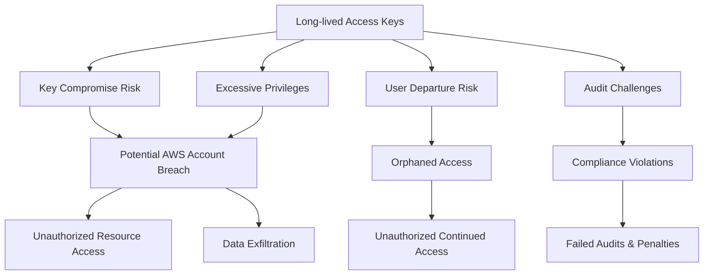
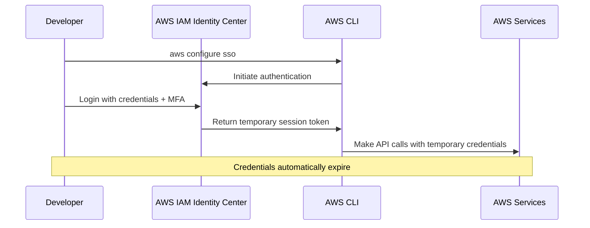
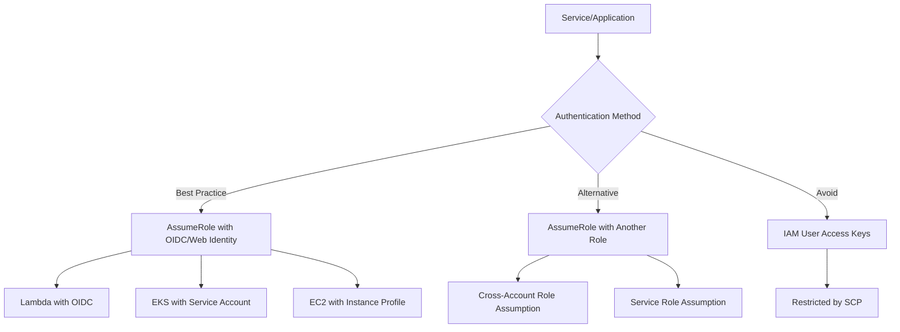
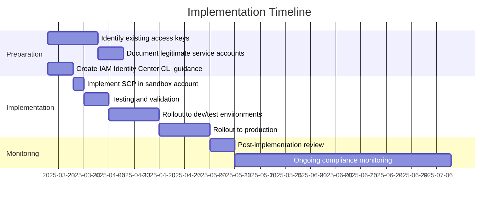

## The Access Key Problem

Picture this: your cloud security team runs a routine audit and discovers dozens of IAM access keys across your AWS accounts. Many are older than 365 days, some belong to departed employees, and a few have unrestricted administrator privileges. Sound familiar?

The proliferation of IAM access keys is one of the most common security challenges in AWS environments. It happens gradually, often starting with "just one access key" for a specific use case, but quickly grows into an unmanageable security liability.

As I've worked with various organizations to implement more secure cloud governance, I've identified a pattern: **the access key problem is fundamentally an architectural issue, not a compliance one**. Organizations that try to solve it through auditing and key rotation policies alone find themselves playing an endless game of whack-a-mole.

## Understanding the Root Causes

Before diving into solutions, let's understand why IAM access keys proliferate in the first place:

1. **CLI/SDK Access Requirements**: Developers and operations teams need programmatic access to AWS
2. **Path of Least Resistance**: Creating an IAM user with access keys is the most straightforward approach
3. **Service Account Needs**: Legitimate automation requires programmatic access
4. **Absence of Governance Controls**: Without preventive controls, access keys multiply
5. **Inadequate Education**: Many users simply don't know better alternatives exist

The most critical insight is that **most human users creating access keys should instead be using temporary credentials** through AWS IAM Identity Center (formerly AWS SSO) or similar federation mechanisms.

## The Security Implications

The risks associated with long-lived access keys are significant:



Long-lived access keys create significant security risks because they:

1. **Don't Automatically Expire**: Unlike session-based credentials, access keys remain valid until explicitly revoked
2. **Lack MFA Protection**: Once created, access keys bypass multi-factor authentication
3. **Are Easily Shared**: Keys can be copied and shared outside of proper security controls
4. **Live in Configuration Files**: Often stored in plaintext in config files or environment variables
5. **Outlive Employment**: Keys often remain active after employees leave

## The IAM Identity Center Solution

AWS IAM Identity Center provides a superior approach for human users needing CLI/SDK access:

1. **Temporary Credentials**: Session-based tokens that automatically expire
2. **Centralized Identity Management**: Integration with your existing identity provider
3. **Permission Set Control**: Standardized access levels across accounts
4. **Easy CLI Configuration**: Simple setup with `aws configure sso`
5. **Multi-Account Support**: Seamless access to resources across accounts

For a developer or operations engineer, the workflow is straightforward:



The key security enhancement here is that credentials are temporary, typically lasting 1-8 hours depending on your configuration.

## Enforcing Secure Access Patterns with SCPs

While education and best practices are important, **prevention is more effective than detection**. This is where Service Control Policies (SCPs) come in.

I've developed an SCP that effectively solves the access key problem by:
1. Allowing CLI/SDK access only through IAM Identity Center roles
2. Preventing the use of IAM user credentials for programmatic access
3. Maintaining support for legitimate service roles where needed

Here's what this policy looks like:

```json
{
  "Sid": "DenyIAMUserCLIAccess",
  "Effect": "Deny",
  "Action": "*",
  "Resource": "*",
  "Condition": {
    "StringLike": {
      "aws:UserAgent": ["*aws-cli*", "*boto*", "*AWS*"]
    },
    "StringNotLike": {
      "aws:PrincipalARN": [
        "arn:aws:iam::*:role/aws-reserved/sso.amazonaws.com/AWSReservedSSO_*"
      ]
    }
  }
}
```

This policy works by:
- Detecting CLI/SDK usage through the User-Agent string
- Allowing such access only when the requesting principal is an SSO role
- Blocking access when the requester is an IAM user

This simple but powerful control prevents the use of long-lived access keys while supporting proper SSO-based access patterns.

### Important Cautionary Notes About aws:UserAgent

While the approach described above can be effective as part of a defense-in-depth strategy, it's essential to understand its limitations:

**AWS Documentation Warning**: AWS explicitly cautions against relying on `aws:UserAgent` as a primary security control. According to the [official AWS documentation](https://docs.aws.amazon.com/IAM/latest/UserGuide/reference_policies_condition-keys.html#condition-keys-useragent):

> Warning: This key should be used carefully. Since the aws:UserAgent value is provided by the caller in an HTTP header, unauthorized parties can use modified or custom browsers to provide any aws:UserAgent value that they choose.

**Real-World Limitations**: In practical testing, I've observed inconsistent behavior with `aws:UserAgent` conditions. The User-Agent string can vary across different AWS SDK implementations, versions, and client applications. If you implement this approach and encounter unexpected access denials, I recommend engaging AWS Support to troubleshoot the specific User-Agent patterns in your environment.

**Alternative Approaches**: Given these limitations, consider these more robust security controls:

1. **IAM Access Key Lifecycle Management**: Implement automated key rotation and strict expiration policies
2. **CloudTrail Monitoring**: Set up alerts for access key creation and usage from unexpected sources
3. **IAM Identity Center (SSO)**: Focus on migrating all human users to temporary credentials
4. **IAM Permission Boundaries**: Apply permission boundaries to limit what IAM users can do, even with valid credentials

The SCP approach described in this article should be viewed as one component of a comprehensive strategy rather than a complete solution on its own.

## Handling Exceptions: Service Accounts

Of course, legitimate service accounts need programmatic access too. For these cases, we have two main approaches:

### Option 1: Allow Specific Service Roles

You can extend the SCP to allow specific service role patterns:

```json
  "StringNotLike": {
    "aws:PrincipalARN": [
      "arn:aws:iam::*:role/aws-reserved/sso.amazonaws.com/AWSReservedSSO_*",
      "arn:aws:iam::*:role/service-role/lambda-*",
      "arn:aws:iam::*:role/service-role/cloudformation-*"
    ]
  }
```

### Option 2: Implement IAM Roles Everywhere

A more comprehensive approach is to eliminate IAM users entirely and implement role-based authentication for all services:



Modern AWS architectures can eliminate most service account use cases by leveraging:

1. **OIDC Federation**: For services that support OIDC (like GitHub Actions)
2. **Instance Profiles**: For EC2-based workloads
3. **EKS Service Accounts**: For Kubernetes workloads
4. **Lambda Execution Roles**: For serverless functions
5. **Cross-Account Roles**: For legitimate cross-account access

## Implementation Best Practices

When implementing this approach, consider these best practices:

1. **Phased Rollout**: Start with non-production environments
2. **User Education**: Ensure users know how to use AWS CLI with SSO
3. **Monitoring**: Implement CloudTrail alerting for access key creation
4. **Documentation**: Create clear procedures for legitimate service account requests
5. **Session Duration**: Configure appropriate token lifetimes (balance security vs. usability)

Here's a sample implementation approach:



## Results: Before and After

Organizations that implement this approach typically see dramatic improvements in their access key situation:

| Metric | Before | After |
|--------|--------|-------|
| Access keys older than 90 days | 75% | <5% |
| Users with admin access keys | 20+ | 0 |
| Failed key rotation events | Monthly | None |
| Audit findings related to keys | High | None |
| Orphaned access keys | Common | Eliminated |

The most significant benefit is the elimination of the "forgotten access key" problem, where keys remain valid long after they should have been removed.

## Conclusion

The proliferation of IAM access keys is a common but serious security risk in AWS environments. By implementing a combination of:

1. AWS IAM Identity Center for human CLI/SDK access
2. Role-based authentication for service accounts
3. Preventive controls through SCPs

You can dramatically improve your AWS security posture while simultaneously reducing administrative overhead.

Remember that cloud security is a journey, not a destination. These controls should be part of a broader cloud governance strategy that includes continuous education, monitoring, and improvement.

What challenges have you faced with access key management? Have you implemented similar controls in your environment? I'd love to hear your experiences in the comments below.

---

*This post reflects my personal experience implementing AWS security controls across various organizations. The code samples provided are examples and should be tested carefully before implementing in your environment.*